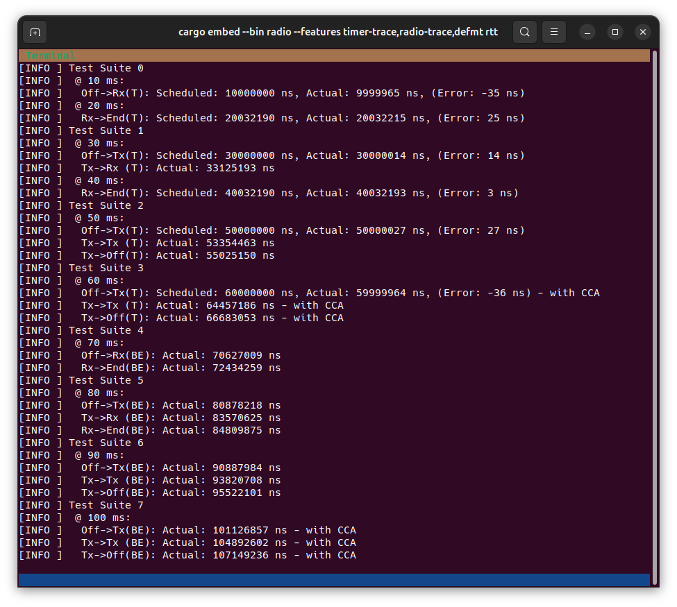
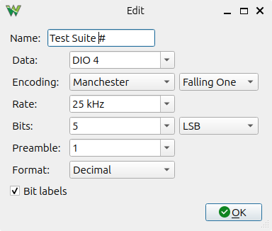
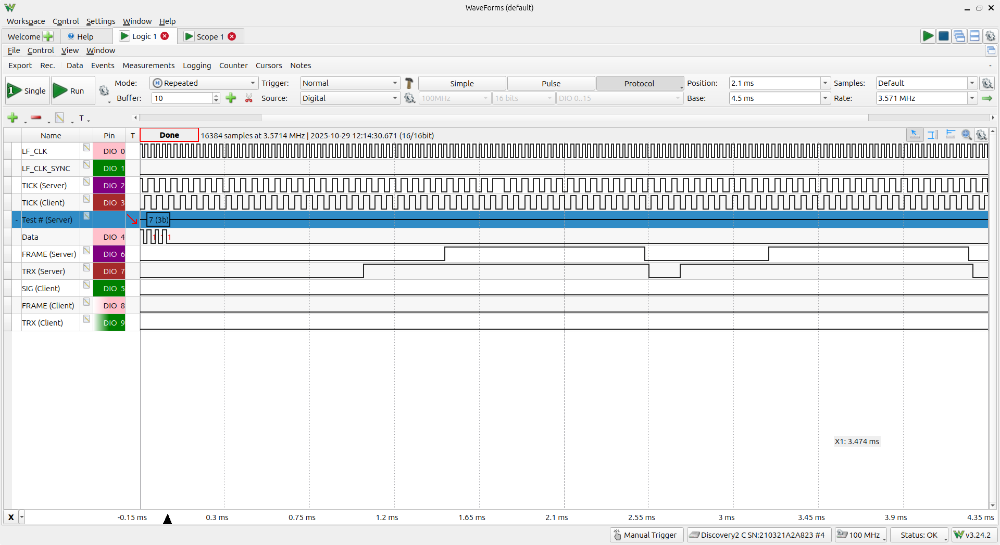
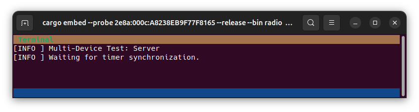
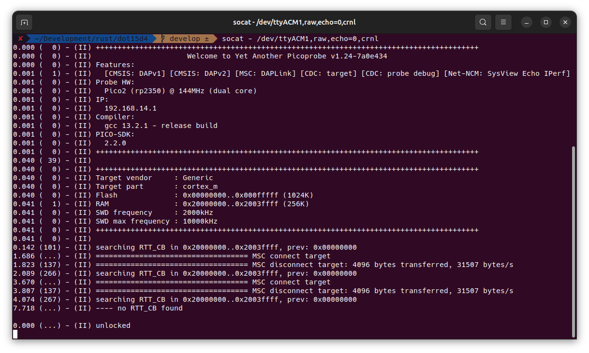
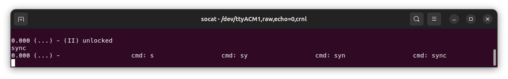
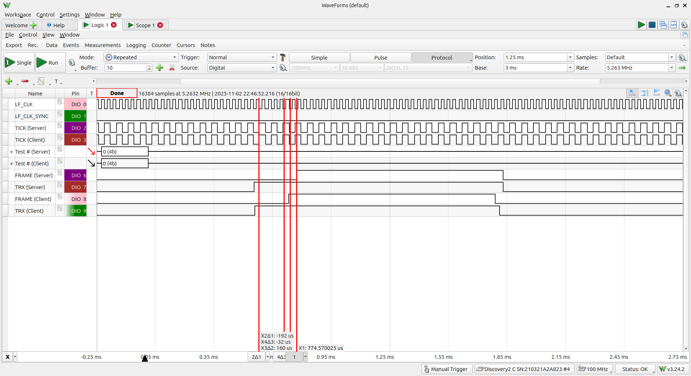
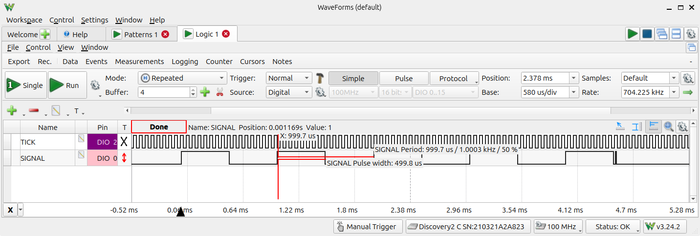
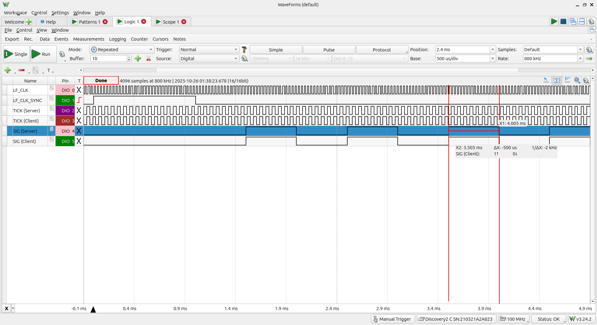
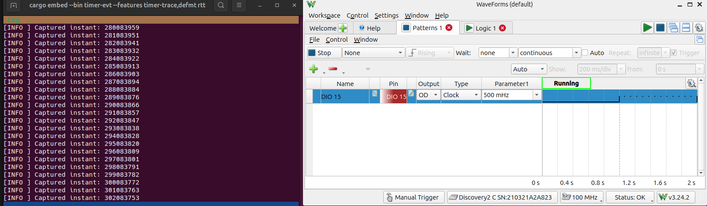

# dot15d4 Examples for nRF52840

The following commands assume that the nRF52840 examples directory is your
current working directory:

```sh
cd examples/nrf52840
```

# Full Stack (embassy, MAC, drivers)

## UDP Echo

### With Ozone and SystemView

```sh
ADDRESS=1 cargo build --bin embassy-net-udp --release --features rtos-trace
mv ../../target/thumbv7em-none-eabihf/release/embassy-net-udp udp-server
ADDRESS=2 cargo build --bin embassy-net-udp --release --features rtos-trace
mv ../../target/thumbv7em-none-eabihf/release/embassy-net-udp udp-client
```

Flash the two binaries to different devices. Connect to one of them in Ozone
and/or SystemView and observe the generated trace:

If you want to observe both applications, you need to attach them to different
hosts.

The example can also be observed in Wireshark with an appropriate IEEE 802.15.4
packet sniffer:

# Driver Layer (radio, timer)

We have several examples that demonstrate and test the radio and timer drivers.

Some of them can be executed in single-device and multi-device setups. No
special setup is required for single-device tests.

In a multi-device setup a single external lf clock on pin X1 (P0.00) drives
several devices synchronously. At the start of the program, clocks are
synchronized with a shared GPIO signal.

A [special hardware setup](../../docs/testbed/README.md) is required to
synchronize devices. Once you have modified your hardware (and only then),
enable the "device-sync" or "device-sync-client" feature to execute multi-device
examples. "device-sync[-client]" must be enabled whenever the LF clock is driven
by an external signal, otherwise you may damage your hardware.

## Single-Device Radio Driver Test

### With cargo embed

```sh
cargo embed [--release] --bin radio --features defmt[,timer-trace][,radio-trace] flash
cargo embed [--release] --bin radio --features defmt[,timer-trace][,radio-trace] rtt
```

Executing the above command will open an RTT terminal that displays test
progress and results:



The example exercises all radio transitions that can be reached without
multi-device interaction including variants with and without CCA.

Tests are either run in "best effort" mode (BE, i.e. sequencing radio states as
fast as possible) or in "timed" mode (T, i.e. using timed transitions where
available).

As you can see from the sample result screenshot: With proper tuning we can keep
the deviation between the scheduled timestamp and the actual (measured)
execution timestamp within +/- one high-precision timer tick (62.5 ns).

### With Ozone and SystemView

```sh
cargo build [--release] --bin radio --features rtos-trace,log
```

Then observe trace and log output via Ozone and SystemView.

### With a logic analyzer

The "timer-trace" and "radio-trace" features enable GPIO tracing.

The "radio-trace" feature captures radio events and makes them visible on output
pins: "RADIO_FRAME" and "RADIO_TRX" (see `PIN_RADIO_FRAME` and `PIN_RADIO_TRX`
in the source code for pin assignments).

The RADIO_FRAME signal raises to logic "high" at nRF's FRAMESTART event and
falls back to logic "low" at the END event. The RADIO_TRX raises at the READY
event and falls at the DISABLED event.

When also activating the "timer-trace" feature **in release mode**, a
Manchester-encoded test suite marker will be output to the TIMER_SIGNAL pin.
Please see the `PIN_TIMER_SIGNAL` constant for pin assignment:



Note that test suite markers will not be produced in debug mode as they require
bit-banging the output at a frequency only achievable with optimizations.

If your logic analyzer supports triggering from Manchester protocol, then this
marker can be used to observe execution of a specific test suite:



Note that the first edge of the Manchester code preamble is triggered precisely
one millisecond before the actual test slot, so you can correlate radio events
with the timer.

## Multi-Device Radio Driver Test

Note: This only works with a [special hardware setup](../../docs/testbed/README.md)
and may damage your device if not properly configured.

To run the radio driver test in multi-device mode, enable the "device-sync"
feature (which automatically implies the "timer-trace" feature):

```sh
cargo embed [--release] --bin radio --features device-sync[-client],defmt[,radio-trace] flash
cargo embed [--release] --bin radio --features device-sync[-client],defmt[,radio-trace] rtt
```

Currently multi-device mode assumes that two devices are run concurrently: Use
the "device-sync" feature to flash one device and the "device-sync-client"
feature to flash the other device.

If the radio test application was properly installed, then you'll see a message
"Waiting for timer synchronization" on both devices.

On the device running the "device-sync" feature:



On the device running the "device-sync-client" feature:


Next connect to the debug terminal of the YAPicoProbe prepared with dot15d4
specific timer synchronization firmware and press the enter key once to unlock
its configuration mode:



To check whether your firmware was correctly installed, enter "help" and confirm
that dot15d4's "sync" command appears in the list of supported commands.

Now enter "sync" into the YAPicoProbe's debug terminal and hit enter:



Then observe test output in the terminal windows connected to your devices.

### Measuring GPIO trace output in multi-device mode

Like in single-device mode you can connect a logic analyzer to analyze timing
via timer and radio trace signals, see the documentation of this mode for
single-device mode above. The "timer-trace" feature is enabled automatically in
multi-device mode as it is required for synchronization. The "radio-trace"
feature needs to be enabled manually.

The following screenshot shows the synchronized output of a multi-device test,
triggering off the Manchester-encoded marker for the test suite:



In this example, the sender is the client and the receiver is the server. The
red lines show the expected timing of preamble, SFD and PHR in relation to the
measured ready and framestart events. This screenshot proves, that nRF52840
radio events are triggered with considerable latency. It also proves that events
do not precisely correspond to symbols. We use these measurements to adjust our
timing so that it matches our specification of +/- 62.5 ns relative timing
error.

## High-Precision Timer Driver Test

The high-precision timer can be triggered and traced via GPIO:

- The `timer-sig` sample generates pulses on the trace pin.
- The `timer-evt` sample observes and logs timestamps of externally generated pulses on the trace pin.

See lib.rs for pin assignments.

Both examples need to be built with the `timer-trace` feature.

### Timer Signal Generator

```sh
cargo embed --release --bin timer-sig --features timer-trace[,device-sync] flash
```

Sample measurement from the `timer-sig` example:



The `measure-rtc-skew` example in `dot15d4-driver/examples/nrf` can be used to
quantify skew.

If you enable the "device-sync" feature, then the `timer-sig` example can be
used to verify proper device clock synchronization when run in a properly
configured [hardware testbed](../../docs/testbed/README.md):



Device synchronization is triggered through YAPicoProbe's debug terminal via the
dot15d4-specific "sync" command. See the radio example above for a more detailed
description of device synchronization.

### Timer Event Observer

The timer event observer requires an external signal to be applied to the trace pin.

Then build and run the example as follows:

```sh
cargo embed --release --bin timer-evt --features timer-trace,defmt flash
cargo embed --release --bin timer-evt --features timer-trace,defmt rtt
```

Sample measurement from the `timer-evt` example:



Note: The even observer example only runs in single-device mode.

# How to observe examples in SystemView

The following steps have been tested for all examples:

1. Download the generated binary to the target via Ozone and halt at the main
   symbol.
2. Open SystemView, connect it to the target and start the session.
3. Return to Ozone and run the program. Then observe SystemView trace and
   terminal output.
