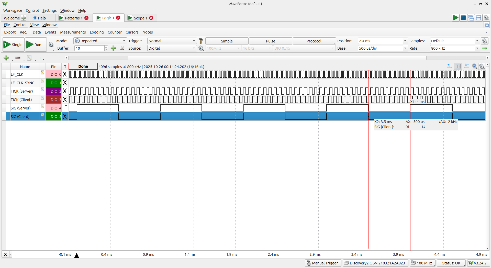
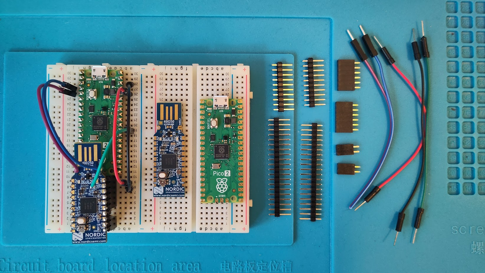
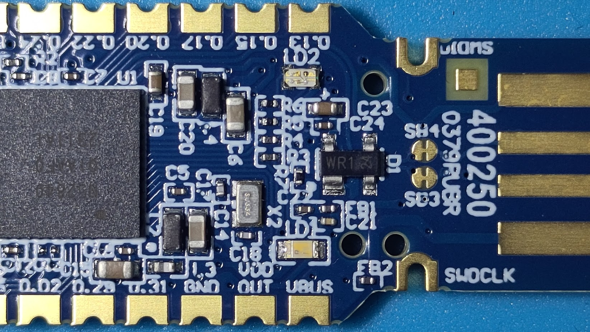
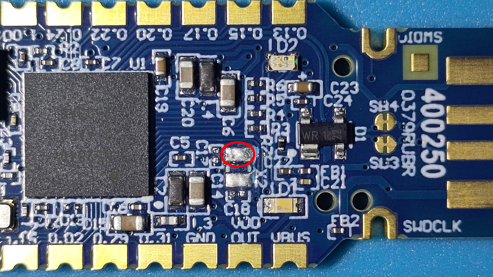
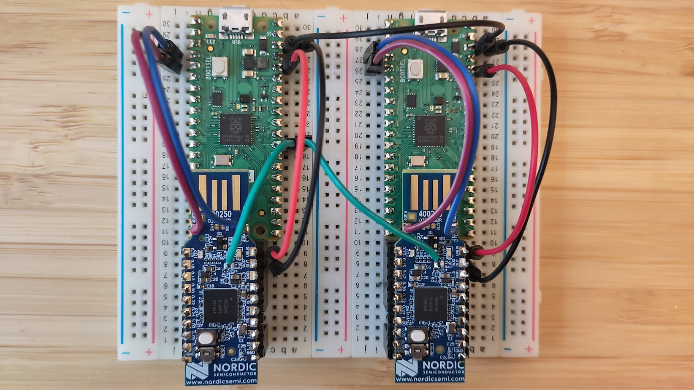
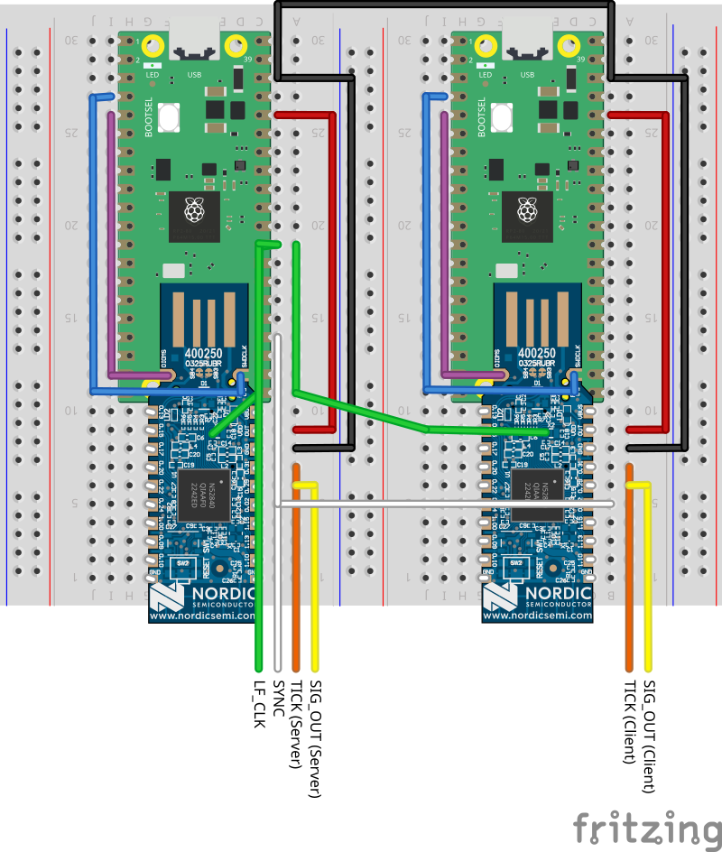
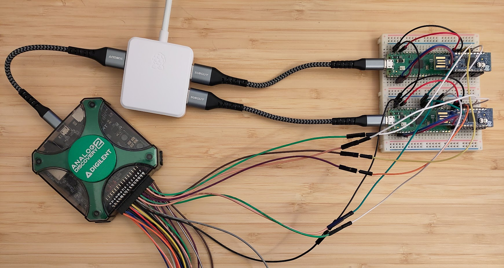

# dot15d4 Testbed

## Synchronization Approach

To debug and test our radio and timer drivers, we need a test setup with precise
timing even across devices:

While basic properties of transitions to and from off and tx tasks may be tested
with a single device, reception obviously requires a sending and a receiving
device that are tightly coordinated if we want to be able to test edge cases and
precise timing across devices.

But even testing tx tasks require several devices if we want to test CCA busy
situations with precise timing.

In our case "precise timing" means +/- one high-precision clock tick, i.e. the
same error margin that we allow for the radio timer itself.

Such synchronization can obviously not be arrived at with independent physical
oscillators. A quick back-of-the-envelope calculation shows this:

Even assuming a high quality 30ppm oscillator (which is the specification of a
typical nRF52840 DK or dongle HF oscillator), we accumulate up to 60µs relative
drift per second between devices (up to 30µs per device).

Measurements of drift between real devices showed that we actually accumulate
something between 50 and 150 µs of drift in about 10 seconds.

In any case this is several orders of magnitude beyond our error margin of +/-
62.5 ns (i.e +/- one high-precision timer tick) on the nRF52840.

Therefore we had to come up with a different solution for our testbed.

The basic idea is to feed an external shared clock signal into the low frequency
timer pin (X1) of the nRF52840. If we manage to synchronize devices around this
clock signal, then we can ensure that their LF clocks (and therefore their RTCs)
won't drift at all, no matter how long our tests last.

In a first naive approach we tried to use the clock signal itself as a
synchronization signal, i.e. letting devices synchronize on the LFCLKSTARTED
event of the CLOCK peripheral.

The following screenshot of our final (well-synchronized) result shows why this
doesn't work:



You can see that the RTC tick signals (routed to a GPIO via PPI and GPIOTE)
exhibit a phase shift of +90 degrees (which amounts to a 180 degree phase shift
between the underlying COUNTER registers).

Other attempts also showed -90 degrees or even 180 degrees of phase shifts
between RTC TICK signal (and the corresponding LFCLKSTARTED events that
triggered their start point).

So it seems that switching over from the internal RC oscillator to the external
clock not only takes a non-deterministic number of external clock ticks but -
more surprisingly - also ends up non-deterministically synchronizing the RTC
counter to either the falling or rising edge of the external clock.

While a simple integer offset between RTC counters would have been easy to
correct for, this obviously doesn't work in case of a non-integer phase shift.

Luckily we have a sophisticated hybrid sleep/high-precision timer that allows us
to synchronize on arbitrary high-precision clock ticks.

So what we ended up doing in addition to clocking RTCs from a common clock
source is sending a shared synchronization signal over a GPIO which we then
measure with the high-precision timer on all devices simultaneously. The
resulting timestamp is then the common base time of all devices.

But there we encountered another gotcha: While we source the LF clock from a
common signal, there is no easy way to also synchronize the HF clocks from an
external source. These clocks continue to run from physically distinct
oscillators. But then we need to have the HF oscillator running to observe the
external event. If it runs for too long, devices will accumulate too much drift
as has been shown above.

If we want a testbed with several devices it may take a tester a few seconds to
flash and reset those devices. Even automating this task will lead to too much
offset between individual devices' high-precision timer start times.

So the final solution synchronizes devices in two steps:

1. Devices will first wait for a rising edge on the synchronization pin. This
   will wake up all CPUs at the same time so that they can synchronize their
   high-precision timer to the shared sleep timer via our hybrid timer API.
2. Then after a short period (currently a millisecond, but could probably even
   be less) the synchronization pin will be pulled low again. It is this second
   event that all devices will measure with their high-precision clock.

It is easy to see that in a time span of 1 ms (1000000 ns), a 30ppm oscillator
will accumulate at most 30ns of drift, ie max. 60ns of drift between devices. We
actually measure even less drift in practice. So now we're within the allowed
error margin of +/- 62.5 ns, independently of phase shift between RTC counters
(+/- ~15 µs).

The result is demonstrated by the above screenshot which was taken from our
[timer-sig](../../examples/nrf52840/src/bin/timer-sig.rs) example across two
devices.

## How to reproduce the testbed at home?

The testbed was designed to be very low cost, easily reproducible and open
source.

### Required Parts

You'll need the following material:

- One or more breadboards (or prototyping PCBs), depending on the number of
  devices that you whish to synchronize.
- An arbitrary number of target devices. We use the nRF52840 dongle as a
  compromise between cost, reliability and availability. But any other nRF52840
  board will do as long as it can accept an external supply (or at least a 3.3V
  logic level on its pins) and you can access the nRF52840's X1 pin (e.g. by
  de-soldering the LF oscillator).
- One Raspberry pico2 per target device - or any other microprocessor that is
  compatible with [YAPicoProbe](https://github.com/rgrr/yapicoprobe).
- Two 0.1 inch (female) pin sockets per target device with at least five
  positions (up to 10 positions at most).
- Two 0.1 inch (male) pin headers per target device with 10 positions (for the
  nRF52840 dongle).
- Two 0.1 inch (male) pin headers per target device with 20 positions (for the
  pico2).
- Sufficient breadboard jumper wires (see photographs and connection diagram
  below).
- One high-quality A-to-micro-B USB cable per target device.
- A USB hub with sufficient outlets for all your target devices.
- soldering equipment
- Optionally a microscope or at least a magnifying glass for your comfort.
- Some good logic analyzer. The logic analyzer should be able to decode and
  trigger on Manchester encoded signals if you want it to synchronize to
  specific radio tests later. Additionally (and optionally) an oscilloscope with
  sufficient bandwidth to measure offsets in the order of a few nanoseconds.



### Hardware Assembly

In a first step you should cut SB-2 and solder SB-1 as described in the nRF52840
dongle's user guide in section 6.3.2 (external regulated source). This is
required to power the dongle from the pico2. If you run it off VUSB, it will
regulate the voltage down to 1.8V internally. Applying the pico's 3.3V signals
to the dongle's GPIOs will then exceed its maximum rating.

Next you'll have to identify the LF oscillator (X2) and its accompanying
capacitors (C17, C18). You need to carefully de-solder these three components
without bridging the then exposed solder pads. I recommend doing this under a
microscope or at least under a good magnifying glass so that you don't damage or
accidentally de-solder other components.

Before:



After:


Now you need to cut one of your jumper wires, remove the insulation to expose a
very short piece of copper wire and solder that to the left of the two exposed
oscillator pads, assuming that the dongle's USB connector points away from you.
See the marked pad in the following photograph:



Then you need to solder similarly cut wires to the SWDIO and SWDCLK castellated
pins to the left and the right of the USB connector.

Next you can solder pin headers to the pico2 and the dongle. I recommend
soldering the dongle while plugged into a breadboard which makes it much easier
to achieve clean and well-aligned solder joints and upright connectors.

Finally you can assemble your parts on a breadboard and connect the jumper wires
for power, external clock and SWD:



Now you're ready to flash the pico2 with the appropriate firmware to turn it
into a debug probe.

## Flashing the Probes

The probes will run two patched versions of the
[YAPicoProbe](https://github.com/rgrr/yapicoprobe) firmware:

- One of your probes needs to run the [server version](./yapicoprobe-server.uf2)
  of the firmware that allows it to generate the LF clock and synchronization
  signal for your test devices. (It's time to read the "syntonization approach"
  section above now if you haven't done so far.)
- All other probes can (and should) run [client versions](./yapicoprobe-client.uf2)
  of the firmware.

Having only a single "server" helps you avoid errors when connecting to the
probe and synchronizing devices. Only the server version contains the
synchronization extension of the probe's debug console.

If you want to inspect the firmware or build it on your own, [we have our changes
up on github](https://github.com/fg-cfh/yapicoprobe/commits/feat/dot15d4-sync/).
You can either build it with the default Makefile approach (see the main README)
or in VSCode with the C/C++ and CMake extensions. We patched the YAPicoProbe
source to work with those extensions out of the box.

To actually flash your devices, plug in your pico2s via dedicated USB cables one
by one. When you plug them in for the first time they'll automatically be booted
into the so called "BOOTSEL" mode. This exposes your devices as mass storage
devices named "RP2350". On recent OSes they should be recognized automatically.
If you already flashed something else or want to update the dot15d4 firmware
then you need to hold down the BOOTSEL button on your device while plugging it
into your computer.

In case you encounter any problems at this point, please refer to the
YAPicoProbe documentation.

Now you only need to copy the appropriate firmware version into the folder
representing your device and it should be flashed automatically. If that works,
then the device should be re-mounted as "dot15d4 Server" or "dot15d4 Client"
folder, depending on the firmware version you flashed.

Once you flashed all your devices, you can `probe-rs` list them on the command
line. You should see something like this:

```sh
$> probe-rs list
The following debug probes were found:
[0]: dot15d4 Server CMSIS-DAP -- 2e8a:000c:A8238EB9F77F8165 (CMSIS-DAP)
[1]: dot15d4 Client CMSIS-DAP -- 2e8a:000c:D58B228DD524F21B (CMSIS-DAP)
```

Next you can try to connect to the server device's debug terminal. I'm using
`socat` because it's pre-installed on most Linux devices. But you could of
course also use `minicom`:

```sh
$> socat - /dev/ttyACM1,raw,echo=0,crnl
0.000 (  0) - (II) ++++++++++++++++++++++++++++++++++++++++++++++++++++++++++++++++++++++++++++++++++++++++
0.000 (  0) - (II)                      Welcome to Yet Another Picoprobe v1.24-7a0e434
0.000 (  0) - (II) Features:
0.001 (  1) - (II)   [CMSIS: DAPv1] [CMSIS: DAPv2] [MSC: DAPLink] [CDC: target] [CDC: probe debug] [Net-NCM: SysView Echo IPerf]
0.001 (  0) - (II) Probe HW:
0.001 (  0) - (II)   Pico2 (rp2350) @ 144MHz (dual core)
0.001 (  0) - (II) IP:
0.001 (  0) - (II)   192.168.14.1
0.001 (  0) - (II) Compiler:
0.001 (  0) - (II)   gcc 13.2.1 - release build
0.001 (  0) - (II) PICO-SDK:
0.001 (  0) - (II)   2.2.0
0.001 (  0) - (II) ++++++++++++++++++++++++++++++++++++++++++++++++++++++++++++++++++++++++++++++++++++++++
0.041 ( 40) - (II)
0.041 (  0) - (II) ++++++++++++++++++++++++++++++++++++++++++++++++++++++++++++++++++++++++++++++++++++++++
0.041 (  0) - (II) Target vendor     : Generic
0.041 (  0) - (II) Target part       : cortex_m
0.041 (  0) - (II) Flash             : 0x00000000..0x000fffff (1024K)
0.042 (  1) - (II) RAM               : 0x20000000..0x2003ffff (256K)
0.042 (  0) - (II) SWD frequency     : 2000kHz
0.042 (  0) - (II) SWD max frequency : 10000kHz
0.042 (  0) - (II) ++++++++++++++++++++++++++++++++++++++++++++++++++++++++++++++++++++++++++++++++++++++++
0.042 (  0) - (II)
0.142 (100) - (II) searching RTT_CB in 0x20000000..0x2003ffff, prev: 0x00000000
1.842 (...) - (II) =================================== MSC connect target
1.980 (138) - (II) =================================== MSC disconnect target: 4096 bytes transferred, 31507 bytes/s
2.245 (265) - (II) searching RTT_CB in 0x20000000..0x2003ffff, prev: 0x00000000
3.834 (...) - (II) =================================== MSC connect target
3.971 (137) - (II) =================================== MSC disconnect target: 4096 bytes transferred, 31507 bytes/s
4.237 (266) - (II) searching RTT_CB in 0x20000000..0x2003ffff, prev: 0x00000000
7.882 (...) - (II) ---- no RTT_CB found
```

Of course you need to identify the correct device yourself, it just happens to
be `/dev/ttyACM1` in my case. If in doubt unplug and re-plug your device and
check the listed devices before and after. The probe will expose two terminals
(in my case ttyACM0 and ttyACM1). The second is the debug terminal.

If you managed to connect to your device's debug terminal, you can press the
enter key once to unlock the console, then enter `help`. If you see the
additional `sync` command (server version only!), then everything is ok:

```sh
0.000 (...) - (II) unlocked
help
2.077 (  0) - ------------- commands
2.078 (  1) -    help    - show available variables/cmds
2.078 (  0) -    lock    - lock the configuration parameters
2.078 (  0) -    killall - kill all current configuration parameters
2.078 (  0) -    reset   - restart the probe
2.078 (  0) -    show    - show the current configuration (initially empty)
2.078 (  0) -    <var>=<value> set a variable <var> to <value>
2.078 (  0) -              (probe resets after every change)
2.078 (  0) - ------------- dot15d4
2.078 (  0) -    sync    - emit sync signal           <---- You should see this!
2.078 (  0) - ------------- ini variables
2.078 (  0) -    net
2.078 (  0) -    nick
2.078 (  0) -    f_cpu
2.078 (  0) -    f_swd
2.078 (  0) -    ram_start
2.078 (  0) -    ram_end
2.078 (  0) -    pwd
2.079 (  1) -    rtt
2.079 (  0) -    dap_psize
2.079 (  0) -    dap_pcnt
2.079 (  0) - -------------
```

## Wiring of the Synchronization Signal and Logic Analyzer

We build a Fritzing part for the nRF52840 dongle so that we can document the
final wiring of the clock, synchronization and logic analyzer:



Connect the labelled signals to your logic analyzer to see the same result as
the one documented in the "synchronization approach" section.

And here is a photograph of the fully wired testbed, using Digilent's excellent
Analog Discovery as an affordable logic analyzer and oscilloscope:



## Flashing, Synchronizing and Testing Targets

Please have a look at at our [examples
documentation](../../examples/nrf52840/README.md). It'll show you how you flash
and synchronize targets. I recommend that you try out the `timer-sig` example
before you try to run the `radio` example.
