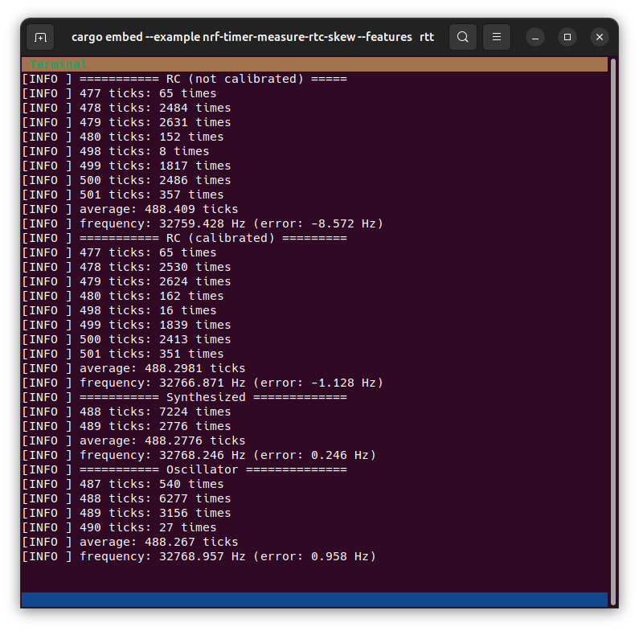

# dot15d4-driver Examples for nRF SoCs

The following commands assume that the examples directory is your current
working directory:

```sh
cd dot15d4-driver/examples/nrf
```

# Measure RTC skew

This sample characterizes the LF clock of the connected target device. It
measures the frequency and jitter of the various LF clock sources which are
driving the RTC peripheral.

## With cargo embed

```sh
cargo embed --release --example nrf-timer-measure-rtc-skew --features defmt,executor,nrf52840[,ext-lf-clk] --no-default-features flash
cargo embed --release --example nrf-timer-measure-rtc-skew --features defmt,executor,nrf52840[,ext-lf-clk] --no-default-features rtt
```

## With Ozone and SystemView

```sh
cargo build --example nrf-timer-measure-rtc-skew --features rtos-trace,log,executor,nrf52840[,ext-lf-clk] --no-default-features
```

## Sample output:



The example displays for each available LF clock source the number of times a
given number of 16 MHz timer ticks was counted per RTC half period. In the
sample output an overall 10.000 measurements were made per clock source.

The RC clock source shows considerable jitter (477 to 501 ticks), even after it
has been calibrated. The gap between 480 and 498 ticks indicates that duty cycle
is not 50%.

The oscillator shows more stable behavior but due to phase drift between the LF and HF clock, any synchronization between the two clocks (as in our hybrid timer) will systematically suffer +/- 62.5 ns phase error in addition to oscillator jitter.

The synthesized clock is directly derived from the HF clock, so measuring it from the LF side will always yield the exact same result.

The nRF52840's LF clock skew is a [known
problem](https://github.com/dot15d4-rs/dot15d4/issues/83). See the linked issue
for more context.
